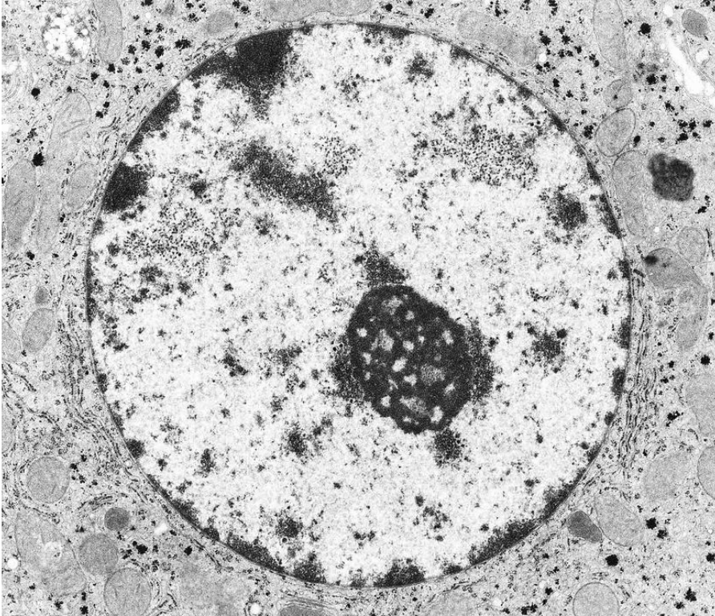

# Breast Cancer Tumor Classification using Machine Learning
We utilize an anonymized dataset of Breast Cancer tumor cell nucei data computed from fine needle aspirate (FMA) of breast mass. This data was originally provided by the University of Wisconsin and obtained here from the University of California: Irvine machine learning repository. 
https://archive.ics.uci.edu/dataset/17/breast+cancer+wisconsin+diagnostic

